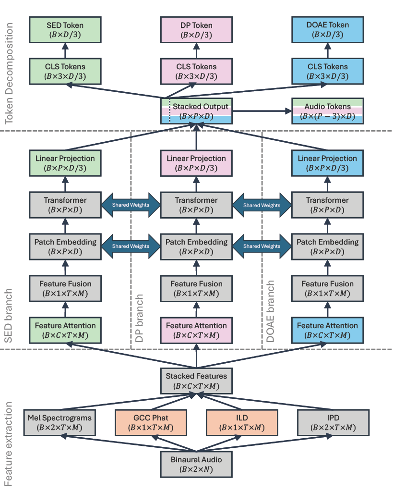

# DSpAST: Disentangled Spatial Audio Spectrogram Transformer

<p align="center">
  
</p>

This repository contains the code and model checkpoints of [DSpAST: Disentangled Representations for Spatial Audio Reasoning with Large Language Models](https://arxiv.org/abs/2509.13927) and is a fork of the [SpatialAST Repository](https://github.com/zszheng147/Spatial-AST/tree/main).

***

## Installation


To setup the environment, please use the following commands:
```
conda env create -f environment.yml
bash timm_patch/patch.sh
```

***

## Dataset

DSpAST is trained and evaluated using a binaural dataset based on [Audioset](https://research.google.com/audioset/) and [SoundSpaces 2.0](https://soundspaces.org) that was used to train the binaural encoder SpatialAST of [BAT](https://zhishengzheng.com/bat/). More details how to download the dataset can be found in the [SpatialAST Repository](https://github.com/zszheng147/Spatial-AST/tree/main).

***

## Training

DSpAST is trained in three stages. For each stage, we provide a training script and trained checkpoint:

| Stage | Audioset split | Epochs | Loss Weights (SED, DP, DOAE) | Training Script | Checkpoint |
| :---: | :---: | :---: | :---: | :---: | :---: |
| 1 | unbalanced (10% per epoch) | 100 | (1, 0, 0) | `scripts/finetune-stage1.sh` | |
| 2 | unbalanced (1% per epoch) | 50 | (100, 2, 1) | `scripts/finetune-stage2.sh` | |
| 3 | balanced (100% per epoch) | 50 | (100, 2, 1) | `scripts/finetune-stage3.sh` | |

***

## Inference

For inference, the script `scripts/inf.sh` can be used. On our system, the performances obtained with our provided checkpoints are:

| Binaural Encoder | mAP (↑) | ER20° (↓) | MAE (↓) | DER (↓) |
| :---: | :---: | :---: | :---: | :---: |
| [SpatialAST](https://github.com/zszheng147/Spatial-AST/tree/main) | 49.90 | 24.43 | 17.87 | 32.50 |
| DSpAST (stage 1) | 53.05 | 98.56 | 95.57 | 97.58 |
| DSpAST (stage 2) | 52.64 | 20.31 | **14.44** | 28.35 |
| DSpAST (stage 3) | **54.53** | **20.28** | **14.44** | **28.03** |

Similar performance improvements can also be observed when using DSpAST as a binaural encoder for spatial audio reasoning with LLMs. Please take a look at our [paper](https://arxiv.org/abs/2509.13927).

***

## References

If you use any part of this code for your work, we kindly ask you to cite the following papers:

```
@unpublished{wilkinghoff2025dspast,
    author     = {Wilkinghoff, Kevin and
                  Tan, Zheng-Hua},
    title      = {{DSpAST:} Disentangled Representations for Spatial Audio Reasoning with Large Language Models},
    note       = {arXiv:2509.13927},
    year       = {2025}
}
```
and the original [BAT](https://zhishengzheng.com/bat/) paper, which is the foundation of this work:
```
@inproceedings{zheng2024bat,
  author       = {Zhisheng Zheng and
                  Puyuan Peng and
                  Ziyang Ma and
                  Xie Chen and
                  Eunsol Choi and
                  David Harwath},
  title        = {{BAT:} Learning to Reason about Spatial Sounds with Large Language Models},
  booktitle    = {Proc. ICML},
  year         = {2024}
}
```
